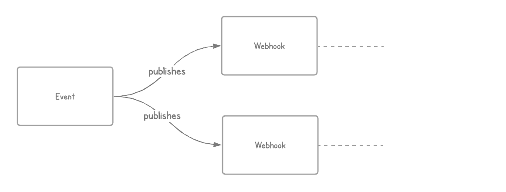

# Webhooks 2.0

You’re viewing the documentation for Webhooks v2.0. For v1.x [click here](docs/README.md)

Table of Contents
-----------------

- [Webhooks 2.0](#webhooks-20)
  - [Introduction](#introduction)
  - [Concepts](#concepts)
    - [Webhook](#webhook)
    - [Recipient](#recipient)
    - [Fan Out](#fan-out)
    - [Fan In](#fan-in)
  - [API](#api)
    - [NotifierFactoryInterface](#notifierfactoryinterface)
    - [NotifierInterface](#notifierinterface)
  - [Getting Started](#getting-started)
      - [Dependencies](#dependencies)
  - [Usage](#usage)
  - [Modelling](#modelling)
      - [No Fans](#no-fans)
      - [Event Fan Out](#event-fan-out)
      - [Webhook Fan In](#webhook-fan-in)
      - [Webhook Fan Out](#webhook-fan-out)
      - [Recipient Fan In](#recipient-fan-in)
      - [Advanced example](#advanced-example)
  - [License](#license)

Introduction
------------

Aligent/Webhooks is a flexible event driven webhook framework for Magento 2.

If you've never heard about webhooks before, [read this first](https://en.wikipedia.org/wiki/Webhook).

This module can effectively decouple the event, the hook and the recipient. This allows for very flexible implementations of message delivery.

How to fan in or fan out an event, hook or the recipient is upto the user and is a business logic.

Concepts
--------

### Webhook

A **Webhook** represents a hook that recipients can hook into and listen for updates.

### Recipient

A **Recipient** is an entity that subscribes to one or multiple webhooks.

### Fan Out

**Fan out** refers to the pattern used to model an information exchange that implies the **delivery** of a message to one or multiple destinations.

### Fan In

**Fan in** refers to the pattern used to model an information exchange that implies the **collection** of a message from one or multiple destinations. This is the inverse of Fan out.

Fan out and Fan in are important concepts to understand to model an effective webhook integration.

API
---

### NotifierFactoryInterface

The notifier factory interface provides the common interface for all notifier factories. The notifier factory serves as an abstract factory and will generate the concrete classes as required.

### NotifierInterface

The notifier interface provides the common interface for all notifer
implementations.


Getting Started
---------------

#### Dependencies

The module relies on `RabbitMQ` as the underlying queue message broker, therefore it needs to be enabled and configured.

Usage
-----

Creating webhooks is very straightforward. A hook is defined in a `webhooks.xml` specifing a unique name for the hook along with information on how to resolve it.

```xml
<webhook hook_name="custom">
    <service class="instance" method="method"/>
</webhook>
```

This is kind of similar to a `webapi.xml` where a route is specified along with which class and method to execute.

Modelling
---------

Because you can apply the fan in and fan out patterns to events, webhook and recipients, you can create flexible combinations of message delivery.

[wip: briefly explain this] Either of any does not have to be in sequential or parallel, or even within the same request lifecycle.

#### No Fans

In this model there are no fans; the message delivery is from one source to one destination.


#### Event Fan Out




#### Webhook Fan In


#### Webhook Fan Out

#### Recipient Fan In

#### Advanced example


License
-------
